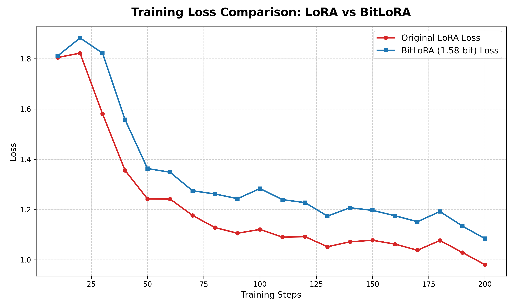

# python-BitLoRA-research
본 저장소는 BitNet b1.58의 BitLinear 모듈을 **LoRA**에 접목하여, 파인튜닝 시 어댑터 A와 B를 ternary로 양자화했을 때의 성능을 확인
## 연구 배경 및 목적
- LoRA의 Adapter A와 B를 1.58-bit로 양자화하여 비트넷의 파인튜닝 확장성 개선
- FP16 어댑터를 적용한 모델과 BitLinear 어댑터를 적용한 모델의 성능 비교
- 결과를 바탕으로 LLM2Vec과 같은 임베딩 모델 최적화에 BitNet 구조를 적용할 수 있는지 확인

## Results

### Responses

LoRA(FP16)

[답변]: Myocardial infarction, commonly known as a heart attack, is characterized by several distinct symptoms. The most prominent symptom is chest pain or discomfort that may radiate to other parts of the body such as arms, back, neck, jaw, and stomach. Other signs include shortness of breath, sweating, nausea, vomiting, dizziness, fatigue, weakness, and lightheadedness.

In addition to these general symptoms, some individuals with myocardial infarction also experience specific warning signs like sudden numbness or tingling in one arm or leg, which can be an indication of blocked blood flow due to clot formation. It's important for anyone experiencing any of these symptoms to seek immediate medical attention as soon as possible. Prompt treatment

BitLoRA (1.58-bit)

[답변]: Myocardial Infarction (heart attack) is a medical condition that occurs when blood flow to part of your heart muscle is blocked, usually by a buildup of fat in coronary arteries. The blockage can cause damage or death of heart tissue.

Common Symptoms of Myocardial Infarction include:

1. **Chest Pain**: This pain may radiate to other parts of the body such as arms, jaw, back, neck, and down into one's left arm.

2. **Shortness of Breath**: Difficulty breathing due to reduced oxygen supply from damaged heart muscles.

3. **Nausea and Vomiting**: Feeling sick or vomiting before chest discomfort starts.

4. **Lightheadedness or Dizziness**: Feeling

