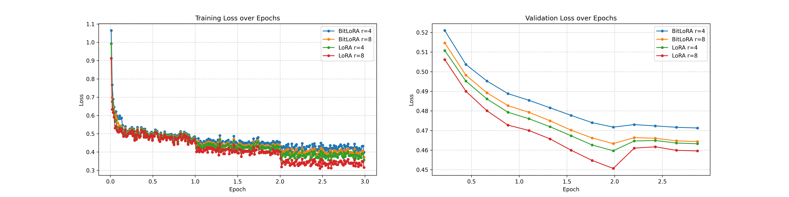

# python-BitLoRA-research
본 저장소는 BitNet b1.58의 **BitLinear** 모듈을 **LoRA**에 접목하여, 파인튜닝 시 어댑터 A와 B를 ternary로 양자화했을 때의 성능을 구체화

## 연구 배경 및 목적
- LoRA의 Adapter A와 B를 1.58-bit로 양자화한 BitLoRA와 기존 FP16 LoRA의 성능 비교
- FP16 어댑터와 BitLoRA trade-off 분석

## Experiment

```
python ./src/train.py --adaptor_type fp16 --r 8 --epochs 3 
```

## Performance Comparison

### Common Experimental Settings

**1. Environment & Data**

- **Language:** `python` 3.11+
- **Base Model:** `meta-llama/Llama-3.2-3B-Instruct`
- **Dataset:** `microsoft/orca-math-word-problems-200k` (Shuffle seed: 42)
  - Train Set: 14,500 samples
  - Validation Set: 500 samples
- **Hardware:** NVIDIA RTX 4060 Ti (8GB VRAM) (System RAM: 32GB)
- **Framework:** `peft` 0.18.1, `PyTorch` 2.10.0+cu128, `transformers` 4.52.0.dev0

**2. Training Hyperparameters**
- **Epochs:** 3
- **Max Sequence Length:** 512 tokens
- **Global Batch Size:** 16
- **Optimizer:** `paged_adamw_8bit`
- **Learning Rate:** 2e-4 (Cosine LR Scheduler)
- **LoRA Target Modules:** All linear layers (`q_proj`, `k_proj`, `v_proj`, `o_proj`, `gate_proj`, `up_proj`, `down_proj`)
- **LoRA Alpha:** `r * 2` (Dropout: 0.05)

### Results



| Method | Trainable Params (%) | Validation loss | GSM8K (CoT) | adaptor size | inference time/cost | 
| :--- | :---: | :---: | :---: | :---: | :---: | 
| **BASE MODEL** | -- | -- | 77.7 | -- | -- | 
| **FP16 Adaptor (r=4)** | 0.188 | -- | -- | -- | -- |
| **FP16 Adaptor (r=8)** | 0.377 | -- | -- | -- | -- |
| **Bit Adaptor (r=4)** | 0.188 | -- | -- | -- | -- |
| **Bit Adaptor (r=8)** | 0.377 | -- | -- | -- | -- |
| **Bit Adaptor (r=16)** | 0.7511 | -- | -- | -- | -- |